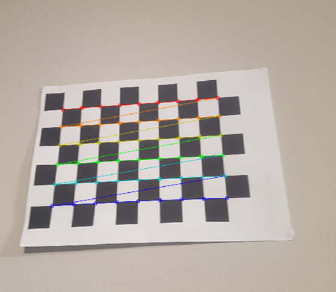

# Algorithm

## Camera Calibration
Currently the program can only calibrate the camera. 

Take images at variable angles of a chessboard and then store it in a folder named "calibration". Make sure the images are JPG format.

The more images, the higher the calibration accuracy. 

## Depth map generation
Currently in progress.

## Point cloud generation
Currently in progress.

## STL file creation from Point cloud
Currently in progress.

